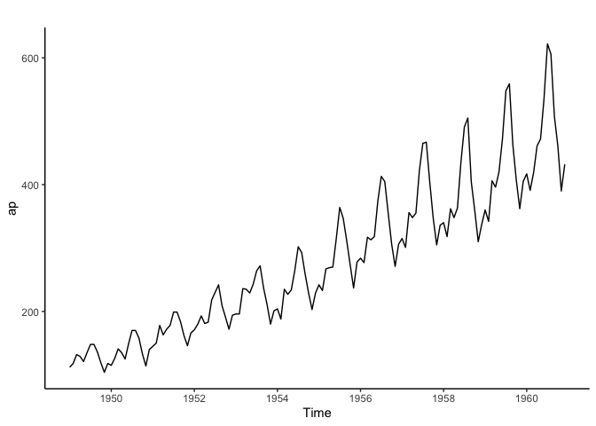

Testing R markdown in gitHub 


``` r
#packages
library(psych)
library(fpp2)
```

```
## Registered S3 method overwritten by 'quantmod':
##   method            from
##   as.zoo.data.frame zoo
```

```
## ── Attaching packages ────────────────────────────────────────────── fpp2 2.5 ──
```

```
## ✔ ggplot2   3.5.2     ✔ fma       2.5  
## ✔ forecast  9.0.0     ✔ expsmooth 2.3
```

```
## ── Conflicts ───────────────────────────────────────────────── fpp2_conflicts ──
## ✖ ggplot2::%+%()   masks psych::%+%()
## ✖ ggplot2::alpha() masks psych::alpha()
```

``` r
library(dplyr)
```

```
## 
## Attaching package: 'dplyr'
```

```
## The following objects are masked from 'package:stats':
## 
##     filter, lag
```

```
## The following objects are masked from 'package:base':
## 
##     intersect, setdiff, setequal, union
```


``` r
ap <- AirPassengers
```


``` r
autoplot(ap) +
  theme_classic()
```

<!-- -->
